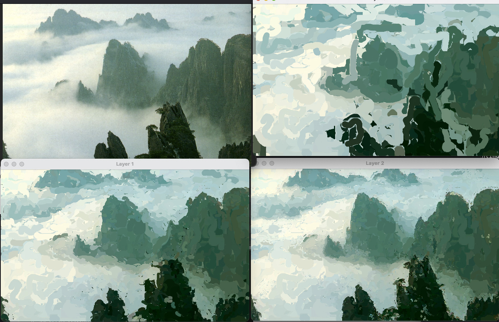

# Painterly Rendering from SIGGRAPH 98

This is the source code for the following paper:

> Aaron Hertzmann. Painterly Rendering with Curved Brush Strokes of Multiple Sizes. Proc. SIGGRAPH 1998. [Project Page](https://mrl.cs.nyu.edu/publications/painterly98/), [ACM paper link](https://dl.acm.org/doi/10.1145/280814.280951)

I haven't looked at this code in more than 20 years, but, amazingly, it runs just fine with no modification.   Thanks to [Manuel Rodriguez Ladrón de  Guevara](https://github.com/manuelladron) for the impetus to dig up the files and for testing it out.

For my NPAR2000 paper, I re-implemented this algorithm in C++/OpenGL, and I may release that code at some point too. That code does not work out of the box.


# Installation

If necessary, install Java with your favorite client. For example, OS X with `homebrew` already installed:

```
homebrew install java
rehash
```

Then, to run
```
cd java
javac Painter.java
java Painter ../images/tomato83.jpg
```
(There will be a mountain of warnings about deprecated APIs.)

You should see an interface like this, showing the input image:


Press **Go!**

Three windows will appear, showing the three layers of paint strokes, with Layer 2 being the final output:


The parameters in the UI should correspond directly to the parameters listed in the paper.

What took minutes of computation in 1998 is now instantaneous.

Some more outputs:




