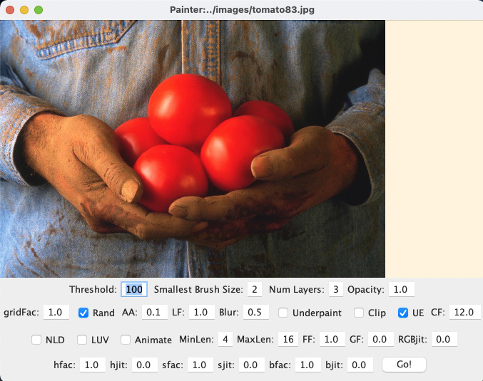
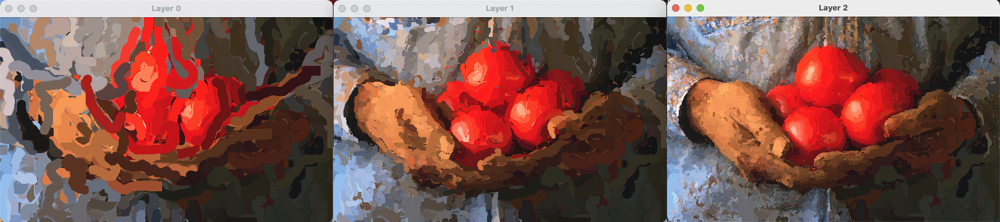
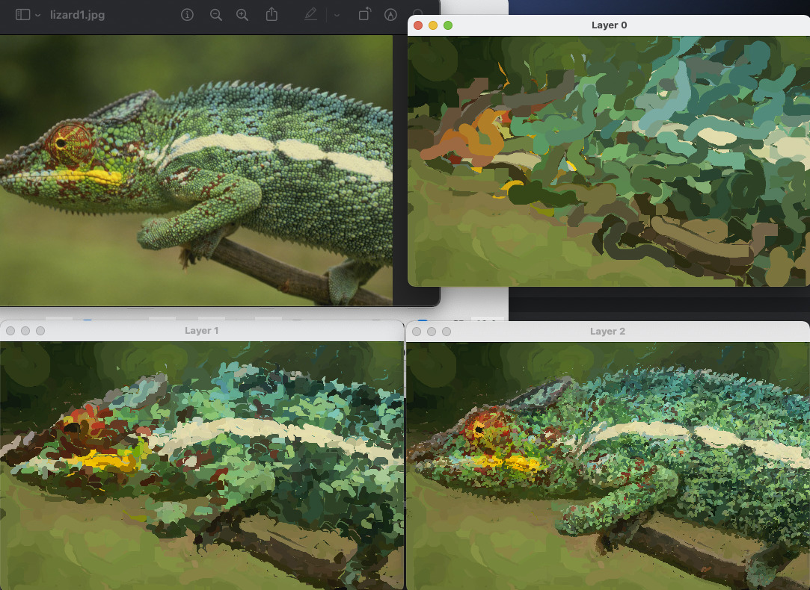

# Painterly Rendering from SIGGRAPH 98 (Java version)

This is the source code for the following paper:

> Aaron Hertzmann. Painterly Rendering with Brush Strokes of Multiple Sizes. Proc. SIGGRAPH 1998. [Project Page](https://mrl.cs.nyu.edu/publications/painterly98/), [ACM paper link](https://dl.acm.org/doi/10.1145/280814.280951)

I haven't looked at this code in more than 20 years, but, amazingly, it ran straight out of the box anyway.   This code is untouched since then, aside from changing one line and adding a license.  Thanks to @manuelladron for the impetus to dig up the files and for testing it out.

Note: for my NPAR2000 paper, I re-implemented this algorithm in OpenGL, and I may release that code at some point too.


# Installation

If necessary, install Java with your favorite client. On OS X with `homebrew` already installed, I used

```
homebrew install java
rehash
```

Then, to run
```
cd java
java Painter ../images/tomatoes83.jpg
```

You should see an interface like this, showing the input image:



Press `Go!`

Three windows will appear, showing the three layers of paint strokes, with Layer 2 being the final output:



The parameters in the UI should correspond directly to the parameters listed in the paper.

What took minutes of computation in 1998 is now instantaneous.

Some more outputs:



